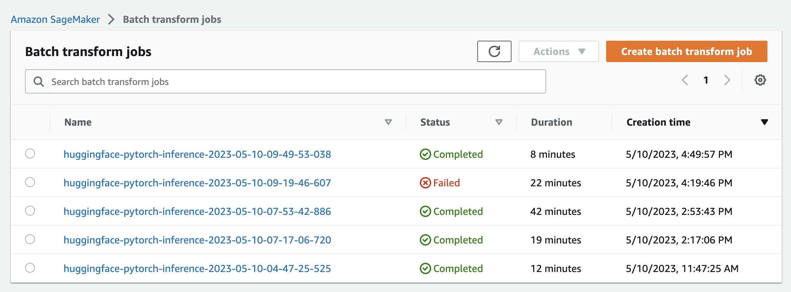
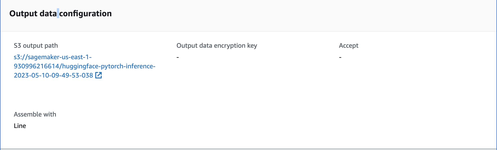

# AWS SageMaker Huggingface Summarization
This repostitory contains the code that utilize SageMaker Batch Transform to summarize a large amount of text data

## Setup

To run the script, you will need to install the following

- Python 3.9
- AWS CLI. See [how to install and setup AWS CLI](docs/AWSCLI.md)

Then, install the required packages
```bash
pip install -r requirements.txt
```

Create a service IAM role for SageMaker, named `sagemaker-summarization`, with the following permissions:
- AmazonS3ReadOnlyAccess
- AmazonSageMakerFullAccess

## Usage
### Step 1: File preparation

#### Preprocess the file
First, we need to prepare the file in `.jsonl` format, which is compatible with SageMaker. In general, you should prepare a directory with multiple files, each should has the format as following
```jsonline
{"inputs": "A long text that need summarization"}
{"inputs": "Another long text that need summarization"}
...
```

To be able to minimize errors and maximize performance, each file should have about 1,000 lines, all of them being inside a directory

For example, a good directory would look like this

```
|_input-10052023
  |_ input-1.jsonl
  |_ input-2.jsonl
  |_ ...
  |_ input-n.jsonl
```


#### Upload to S3
Having prepared the directory as above, now we need to upload it to the created S3 bucket, for example

```bash
aws s3 cp input-10052023 s3://sagemaker-summarization-input --recursive
```

### Step 2: Create SageMaker batch transform job

To create a SageMaker batch transform job, run the script with either one of the two following command

#### Simple usage:
```bash
python sagemaker_batch.py \
--s3-path [YOUR S3 PATH] \
--num-instances 20
```

For example, you could run it like this
```
python sagemaker_batch.py \
--s3-path s3://sagemaker-summarization-input/input-10052023
--num-instances 20
```

#### Full usage:
```bash
python sagemaker_batch.py \
--role-name sagemaker-summarization \
--hf_task summarization \
--hf-model-id sshleifer/distilbart-cnn-12-6 \
--transformer-version 4.26 \
--pytorch-version 1.13 \
--py-version py39 \
--num-instances 5 \
--instance-type ml.g4dn.xlarge \
--assemble-with Line \
--strategy SingleRecord \
--content-type application/jsonn \
--split-type Line \
--s3-path [YOUR S3 PATH]
```

### Step 3: View and download the result

The processing result will be available in the output S3 bucket of the SageMaker Batch Transform job. 

First, access the SageMaker Batch Transform dashboard


Select the job that you have created, and access the URL in `S3 output path`. You can download the result files from this S3 bucket.


Alternatively, you could use the AWS CLI to download the file, for example
```bash
aws s3 sync s3://sagemaker-us-east-1-output/ ./output --recursive
```


## Benchmark
This is the time result being run on an actual AWS account

| Number of record  | Instance type             | No. of instances  | Runtime
| ----------------  | -------------             | ----------------  | ---------------
| 500               | ml.g4dn.xlarge            | 1                 | 9 minutes
| 5K                | ml.g4dn.xlarge            | 5                 | 15 minutes
| 50K               | ml.g4dn.xlarge            | 20                | 38 minutes
| 500K              | ml.g4dn.xlarge            | 20                | ?
| 5M                | ml.g4dn.xlarge            | 20                | ?